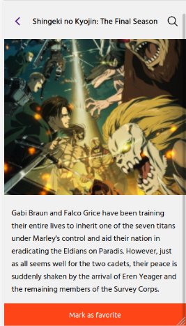

# ANIME CLUB CLIENT

> This project is a mobile single page application built with React and Redux, All data used in the app was retrieved from the API created using Ruby on Rails and is stored in the Redux store, also you can create an account and mark some Animes as favourites.
## Built With

- React.
- Redux.
- redux-thunk.
- axios.

## Demo Screenshots

## Live Demo

[Live version](https://optimistic-khorana-f202db.netlify.app/)

## Prerequisites

node: v12.19.0
## Getting Started
To get a local copy up and running follow these simple example steps.

- Open a terminal or command prompt interface on your PC.
- Clone the repo with: `git clone https://github.com/kenderb/anime-club-client.git`
- On the terminal navigate to the project directory using `cd anime-club-client/`

## 📝 Setup

1. On the terminal navigate to the project directory using `cd anime-club-client/`.
2. Install dependencies using: `npm install`.
2. Run a server using: `npm start`.
3. Open `http://localhost:3000/` in your browser or open the index.html on your browser.

## :straight_ruler: Running test

1. On the terminal navigate to the project directory using `cd anime-club-client/`.
2. Run the test with: `npm test`.

## Authors

👤 **Kender Bolivar**

- GitHub: [@kenderb](https://github.com/ken)
- Twitter: [@KBTarts](https://twitter.com/KBTarts )
- LinkedIn: [KenderBolivar](https://www.linkedin.com/in/kender-bolivar-1736086b/ )

## 🤝 Contributing

Contributions, issues and feature requests are welcome!

Feel free to check the [issues page](https://github.com/kenderb/anime-club-client/issues).

## Show your support

Give a ⭐️ if you like this project!

## :grey_exclamation: Acknowledgments

- Stack Overflow.
- Odin Project.
- [Design by Alexey Savitskiy](https://www.behance.net/gallery/37706679/Circle-(Landing-page-Dashboard-Mobile-App)).

## 📝 License

[MIT LICENSE](LICENSE)